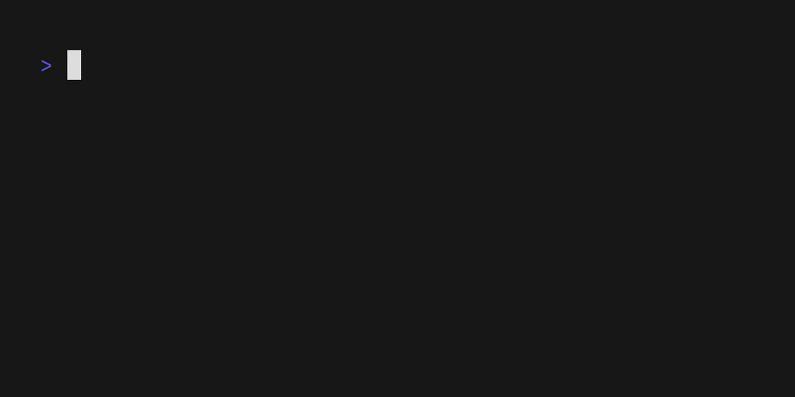

# vhs

- https://github.com/charmbracelet/vhs

## Docker Compose

1. Create the directories

    ```
    mkdir -p vhs/data
    ```

2. Compose file

    ```
    nano vhs/docker-compose.yml
    ```

    ```
    services:
      vhs:
        image: ghcr.io/charmbracelet/vhs
        volumes:
          - ./data:/vhs
        command: "demo.tape"
        restart: "no"
    ```

3. Demo Tape
    ```
    nano vhs/data/demo.tape
    ```

    Paste in the contents from [this example](https://raw.githubusercontent.com/charmbracelet/vhs/main/examples/demo.tape) and save

4. Run
    ```
    cd vhs
    docker compose up -d && docker compose logs -f vhs
    ```

5. Output

    ```
    vhs/data/examples/demo.gif
    ```

    
